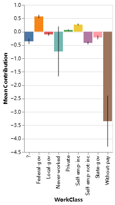
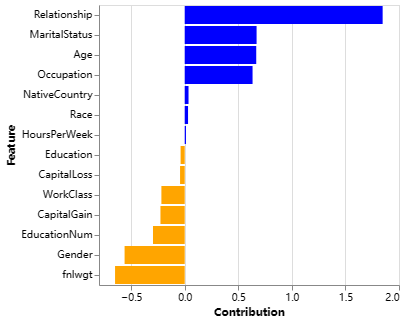
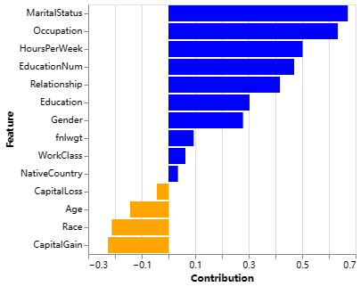
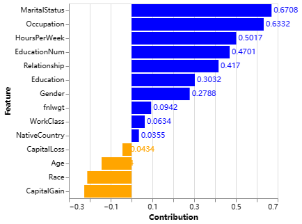

# LLM-XAI

We can generate an agent to interact with a trained Explainable Boosting Machine (EBM) in natural language, allowing it to answer questions, plot charts or make predictions based on the relevant information of the EBM.

**features:**

- Summarize the model or data to allow users to initially understand the model and data.

- Analyze and visualize a specific feature to obtain the impact of different values of the feature.

- Predict the results of certain specific data samples.

- Analyze the prediction results of a sample to obtain the impact of each feature on the prediction.

## example

We have trained an `ExplainableBoostingClassifier` on the [Adult](https://archive.ics.uci.edu/dataset/2/adult) in UCI Machine Learning Database. This is a data record about the annual income of individuals in many European and American countries. The task type is two-class classification, that is, based on the basic information of the individual as a feature, predict whether the annual income is greater than 50K.

```python
ebm = ExplainableBoostingClassifier(feature_names=feature_names)
ebm.fit(X_train, y_train)
```

After training EBM , generate the agent to be used. You can optionally provide a description of the data and the meaning of the y-axis to help LLM understand the data and what to do.

```python
agent = get_agent(llm_gpt4,ebm,df = df,dataset_description = dataset_description,y_axis_description = y_axis_description)
```

### 1.Global interpretability analysis

First, you can ask the agent to tell you the overall situation of the model and the importance of each feature to the model prediction results

```python
agent.run("Summarize the entire model, and tell me the importance of each feature to the model prediction results")
```

> **agent:**
>
> The model is a Generalized Additive Model (GAM) that predicts whether a person makes over 50K a year based on various features. The importance of each feature to the model's predictions is as follows:
>
> - Age: 0.68. This is the most important feature. The older a person is, the more likely they are to earn over 50K a year.
> - WorkClass: 0.14. The type of work a person does has a moderate impact on their income.
> - fnlwgt: 0.12. This feature has a relatively low importance, indicating that the serial number in the Census database has little impact on a person's income.
>
> ...

We now know several features with relatively large contributions, and then we can further check the interpreter's analysis results of each feature:

```python
agent.run("Visually display the contribution of the term WorkClass to predictions.")
```




The job type feature is a discrete feature. We see that most of the values of this feature have a negative contribution to the prediction results.The only two features with obvious positive contributions are Federal-gov and Self-emp-inc, which means working for the federal government as well as self-employed companies can greatly help people earn over 50K a year.


### 2.Local interpretability analysis

We can also use agents to predict and analyze specific samples. Here we select a sample with Income<50K and a sample with Income>50K for analysis:

```python
agent.run("Use the 2nd row of dataframe data as a sample to predict, and tell me the contribution of each feature in this prediction?")
```

> **agent:**
>
> The prediction for the 2nd row of the dataframe is that the person makes less than or equal to 50K a year, with a probability of 0.603. The contribution of each feature to this prediction is as follows: Age: 0.6675, WorkClass: -0.2177, fnlwgt: -0.6502, Education: -0.0384, EducationNum: -0.2961, MaritalStatus: 0.6708, Occupation: 0.6332, Relationship: 1.8473, Race: 0.0311, Gender: -0.5612, CapitalGain: -0.2264, CapitalLoss: -0.0434, HoursPerWeek: 0.0117, NativeCountry: 0.0355. Positive scores indicate a positive contribution to the prediction result, and negative scores indicate a negative contribution. The larger the absolute value of the score, the greater the degree of contribution.

```python
agent.run("Please visualize the contribution of the feature previously obtained through the 2nd row of data in df as a sample.")
```



The prediction results of this sample are <=50K. As for why the model predicts it as <=50K, you can analyze the reasons by looking at the features and values in the picture, for example: the top tow features that have the greatest negative contribution to the prediction results and Values are:

​		fnlwgt= 50567 and Gender= Female

That is, the model believes that the main reason why this person’s annual income is <= 50K is because her gender and serial number. Here, we further return to the previous global interpretability analysis results to see the impact of different values of gender on the model prediction output:

```python
agent.run("Visually display the contribution of the term gender to predictions.")
```


Indeed, being a female has a significant negative impact on whether the annual income exceeds 50K, and this impact is much greater than the positive impact of being a male. Then let's look at another sample:

```python
agent.run("Use the 3rd row of dataframe data as a sample to predict, and tell me the contribution of each feature in this prediction?")
```

> **agent:**
>
> The prediction for the 3rd row of the dataframe is that the person makes over 50K a year, with a probability of 0.6366. The contribution of each feature to this prediction is as follows: Age: -0.1434, WorkClass: 0.0634, fnlwgt: 0.0942, Education: 0.3032, EducationNum: 0.4701, MaritalStatus: 0.6708, Occupation: 0.6332, Relationship: 0.4170, Race: -0.2121, Gender: 0.2788, CapitalGain: -0.2264, CapitalLoss: -0.0434, HoursPerWeek: 0.5017, NativeCountry: 0.0355. Positive scores indicate a positive contribution to the prediction result, and negative scores indicate a negative contribution. The larger the absolute value of the score, the greater the degree of contribution.

```python
agent.run("Please visualize the contribution of the feature previously obtained through the 3rd row of data in df as a sample.")
```



The prediction results of this sample are >50K. As for why the model predicts it as >50K, you can analyze the reasons by looking at the features and values in the picture, for example: the top tow features that have the greatest negative contribution to the prediction results and Values are:

​		MaritalStatus = Married-civ-spouse and Occupation = Exec-managerial

That is, the model believes that the main reason why this person’s annual income is greater than 50K is because he is a non-military spouse and an executive manager.

If we are not satisfied with the previously generated chart, we can also ask the agent to modify it.

```python
agent.run("Based on the chart you just drew, Add to each bar in the chart the value representing the ordinate of the bar. ")
```




### 3.prediction

Finally, after understanding the contribution of each feature, you can let the agent make actual predictions, that is, get the prediction results 	and probability of the specific data in the file through EBM.

```python
agent.run("Use the seventh to ninth rows of data in the dataframe as prediction samples and tell me the prediction results of each row.")
```

> **agent:**
> 
> The prediction for the seventh row of the dataframe is that the person makes less than or equal to 50K a year, with a probability of 0.9715. The prediction for the eighth row of the dataframe is that the person makes less than or equal to 50K a year, with a probability of 0.9933. The prediction for the ninth row of the dataframe is that the person makes less than or equal to 50K a year, with a probability of 0.8077.

