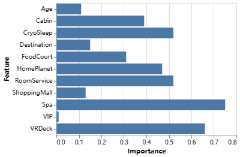
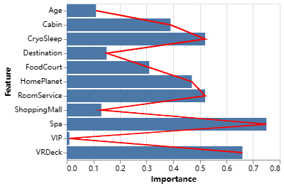

# LLM-XAI

We can generate an agent to interact with a trained Explainable Boosting Machine (EBM) in natural language, allowing it to answer questions, plot charts or make predictions based on the relevant information of the EBM.

## example

We have trained an `ExplainableBoostingClassifier` on the Kaggle [Spaceship Titanic Dataset](https://www.kaggle.com/competitions/spaceship-titanic/overview). This dataset is from 2022, so GPT-3.5 and GPT-4 have not seen it during training.

```python
ebm = ExplainableBoostingClassifier(feature_names=feature_names)
ebm.fit(X_train, y_train)
```

After training EBM , generate the agent to be used. You can optionally provide a description of the data and the meaning of the y-axis to help LLM understand the data and what to do.

```python
agent = ebm_agent(llm_gpt4,ebm,df = df,dataset_description = dataset_description,y_axis_description = y_axis_description)
```

First, you can ask the agent to tell you the overall situation of the model and some special features.

```python
agent.run("Summarize the entire model, introduce and describe several features that have a greater impact on the prediction results.")
```

> agent:
>
> The Generalized Additive Model (GAM) is used to predict whether a passenger was transported to an alternate dimension during the Spaceship Titanic's collision with the spacetime anomaly. The model uses several features from the passenger's personal records, and each feature contributes differently to the prediction. 
>
> The features with the greatest impact on the prediction results, based on their global feature importances, are "CryoSleep", "RoomService", "Spa", and "VRDeck"
>
> ...

You now know several features with relatively large contributions, and then you can get the contribution values of the features more intuitively through charts. You can also modify the generated chart when it is not suitable.

```python
agent.run("visualize the importance of each feature.")
```



```python
agent.run("Add a polyline to the previously generated chart to represent the changing trend of the importance of each feature.")
```




Finally, after understanding the contribution of each feature, you can let the agent make actual predictions, that is, get the prediction results and probability of the specific data in the file through EBM.

```python
agent.run("Use the seventh to ninth rows of data in the dataframe as prediction samples and tell me the prediction results of each row.")
```

> agent:
> 
> The prediction for the seventh row is that the passenger was likely transported to an alternate dimension, with a probability of approximately 0.9494. The prediction for the eighth row is also that the passenger was likely transported to an alternate dimension, with a probability of approximately 0.9302. The prediction for the ninth row is the same, with a probability of approximately 0.9503.

